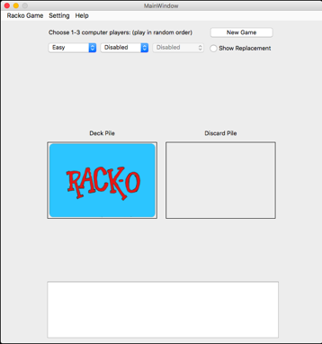

### Rack-O! Game
[Screenshots] / [Youtube demo]

  

My Rack-O! game support 2 to 4 hand of cards as the real game (40 - 60 cards).  [See rules]  
A user can play with 1 to 3 computer hands.  For a 4 hands game, user may play 2 hands alternatively with 2 computer hands.

There are 3 level of computer player to choose from:
* Easy - Pick the best sorted order and fill the missing slots.  
       Written by Arvind Bhusnurmath, Kristen Gee, and Karen Her - copied from [Nifty assignments 2016, Racko]
* Moderate - Even distribution to fill all slots.  
  Try to keep the numbers in sequence for higher winning points.  
  When detect deadlock, resort the rack.
  <pre>
  Example:  2  4  8 18  3 24  7 13 33 39
               H     H        H  H
    If the new card is 16, it will place in slot 5.  
    To sort the slots 3 to 6, either fill slot 4 from 8 - 16 or fill slot 5 from 18 - 24.
  </pre>
* Hard - Compare both prioritize option above and pick the best choice.  
    <pre>
    Example:  12 25 17 21 31 29 18  2 30 36 
                                       H  H
              Replace 17 with 9
              12 25  9 21 31 29 18  2 30 36
                     H           H     H  H
              Replace 2 with 27
              12 25  9 21 31 29 18 27 30 36 
                     H              H  H  H
    </pre>
  Monitor the changes on discard pile and deck pile.  Sort the rack with eliminate the cards held by other players and prevent deadlock issue.  
  Try to keep the numbers in sequence for higher winning points.  
  If too few cards will fill the missing slot, expand the range if possible.  
  When approaching to win such as 475 points, sort minimun 5 slots (+25 points) to win instead of full rack.  

[System requirements and installation]  

### Comparison of difficulty levels
Number of win count in 100 rounds, regradless score:
<pre>
* 2 players racko:  
Easy vs Moderate      Easy vs Hard      Moderate vs Hard
28      72            28      72        40          60

* 3 players racko:  
Easy vs Moderate vs Hard
18      30          52

* 4 players racko:  
Easy x2 vs Moderate    vs Hard
30         32             38
Easy    vs Moderate x2 vs Hard
15         48             37
Easy    vs Moderate    vs Hard x2
9          22             69

Winning scores distribution based on 100 winning rounds of 3 players game:
              75 pts    125 pts    175 pts    275 pts    475 pts
Easy          76        20          4          0          0
Moderate      84        14          2          0          0
Hard          80        17          2          1          0
 
Losing scores distribution based on 100 losing rounds of 3 players game:
               5   10   15   20   25   30   35   40   45
Easy           9   23   18    9   11    9    9    8    4
Moderate      15   20   12   17    5    9   12    7    3
Hard          10   13    8   12   18   17    7   11    4
                            

Regardless the winner in 100 rounds, number deck turnover to complete:
Number of deck turnover:    0   1   2   3   4   5   6   7   8   9   10+  
Moderate vs Easy x3     
40          60             35  50   7   3   4   0   0   0   0   1   0
(14 deadlock detected)
Hard     vs Easy x3
50          50             57  40   3   0   0   0   0   0   0   0   0

</pre>
### GUI design

The GUI is writtern in pyqt5, using [py4j] connected to computer player support in java.  Card image use [Nifty assignments 2016, Racko].

Change the game setting from the menu bar:  
Single round - 75 points  
Full game - 500 points  
Custom setting - 75 to 1000 points

Choose your choice of computer players, click "NEW" button to start the game.  
An option to show card replacement by the players.  
On player's turn, the rack will highlight in lighter color.  
<pre>
Blue   - initial card when start the game.
Green  - card has been replaced.  If card from discard pile, also display card number.
Yellow - player pick the card to place in discard pile.
</pre>

Computer take over option provided.  Inter breaks between threads to avoid bus error.

### How to play
The left rack of cards is the user's rack.  
* To keep the top card from discard pile, simply click the card you want to replace.  
* Otherwise, click the deck pile to turn over the top card from the deck pile.  
* Then click your card to replace it or click the deck pile again to move it to discard pile.  
For 4 hands and play with 2 sets.  The second set on the right side.

The user may terminate the game at any time.  
An option to have a computer player (Moderate level only) take over and finish the remaining game in fast speed.

[Development history]

[Nifty Assignments 2016, Racko]: http://nifty.stanford.edu/2016/arvind-racko/
[See rules]: http://www.hasbro.com/common/instruct/Racko(1987).PDF
[Development history]: https://github.com/mwong510ca/Racko_ComputerStrategy/tree/master/older%20versions
[py4j]: https://www.py4j.org
[Screenshots]: https://github.com/mwong510ca/Racko_ComputerStrategy/tree/master/screenshots
[System requirements and installation]: https://github.com/mwong510ca/Racko_ComputerStrategy/tree/master/gui(pyqu5)
[youtube demo]: https://www.youtube.com/watch?v=IRlMazuIX1c&list=PLRnfrf3rzEFnVm00w-JZ-693lRKXiFRfU

