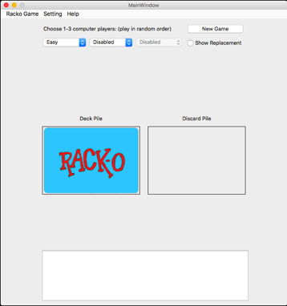

### Rack-O! Game
  

### How to Install
System Requirement :  
* [Java Virtual Machine version 8]: (Most of the machines already have it)  
* [Python 3.5]
* [py4j] for Python
* [PIL] or Pillow for Python 3.5
* [Qt] 5.6 or 5.7 (may not work on older versions)
* [PyQt5]

Download and unzip the [RackoGame.zip] file from my cloud drive.  (Include all components - jar files, images)   

Start from Terminal: python3 appRacko.py

### How to Play  
The left rack of cards is the user's rack.  
* To keep the top card from discard pile, simply click the card you want to replace.  
* Otherwise, click the deck pile to turn over the top card from the deck pile.  
* Then click your card to replace it or click the deck pile again to move it to discard pile.  
For 4 hands and play with 2 sets.  The second set is the right rack.

The user may terminate the game at any time.  An option to have a computer player (Moderate level only) take over and finish the remaining game in fast speed.

### Settings
Change the winning score from setting: 
* One round, 75 points
* Full game, 500 points
* Custom setting from 75 to 1000 points

[Java Virtual Machine version 8]: http://www.oracle.com/technetwork/java/javase/downloads/jre8-downloads-2133155.html
[Python 3.5]: https://www.python.org/downloads/
[py4j]: https://www.py4j.org/install.html
[PIL]: https://wp.stolaf.edu/it/installing-pil-pillow-cimage-on-windows-and-mac/
[Qt]: https://www.qt.io
[PyQt5]: http://pyqt.sourceforge.net/Docs/PyQt5/installation.html
[RackoGame.zip]: https://my.pcloud.com/publink/show?code=XZ8RTNZfWAIlkUpFXYS6uGVmr4azXJ014Pk
